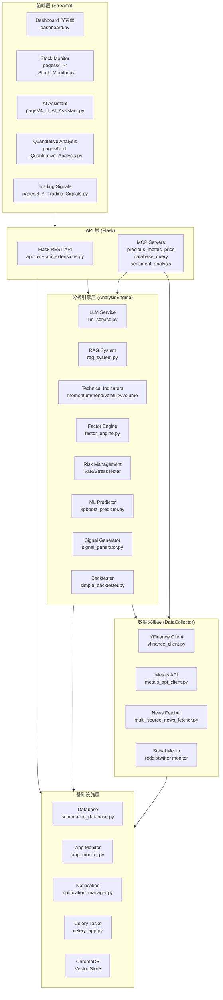

# PreciousInsight 前端 Web UI 产品需求文档 (PRD)

> **版本**: v1.0
> **日期**: 2026-06-04
> **状态**: 草案
> **作者**: PreciousInsight 开发团队

---

## 目录

1. [文档框架与项目背景](#1-文档框架与项目背景)
2. [Dashboard 仪表盘 UI 需求](#2-dashboard-仪表盘-ui-需求)
3. [Stock Monitor 页面需求](#3-stock-monitor-页面需求)
4. [AI Assistant 页面需求](#4-ai-assistant-页面需求)
5. [Quantitative Analysis 页面需求](#5-quantitative-analysis-页面需求)
6. [Trading Signals 页面需求](#6-trading-signals-页面需求)
7. [后端 API 集成点](#7-后端-api-集成点)
8. [用户体验流程与线框图](#8-用户体验流程与线框图)
9. [数据可视化与实时更新技术规范](#9-数据可视化与实时更新技术规范)
10. [安全认证与性能可扩展性](#10-安全认证与性能可扩展性)

---

## 1. 文档框架与项目背景

### 1.1 项目概述

PreciousInsight 是一个面向贵金属市场的智能金融分析平台。系统整合了实时数据采集、量化分析引擎、大语言模型(LLM)服务和可视化仪表盘，为投资者和分析师提供一站式的市场监控、技术分析、风险评估和 AI 辅助决策功能。

### 1.2 系统架构总览



### 1.3 核心模块映射关系

| 前端页面 | 文件路径 | 主要依赖后端模块 |
|---------|---------|----------------|
| Dashboard 仪表盘 | `dashboard.py` | `app_monitor.py`, MCP precious_metals_price |
| Stock Monitor 股票监控 | `pages/3_📈_Stock_Monitor.py` | `YFinanceStockClient`, `api_extensions.py` |
| AI Assistant 智能助手 | `pages/4_🤖_AI_Assistant.py` | `LLMService`, `RAGSystem`, `signal_generator`, `VaRCalculator`, `XGBoostPredictor` |
| Quantitative Analysis 量化分析 | `pages/5_📊_Quantitative_Analysis.py` | `FactorEngine`, `VaRCalculator`, `StressTester`, `XGBoostPredictor`, `SimpleBacktester`, `indicators/*` |
| Trading Signals 交易信号 | `pages/6_⚡_Trading_Signals.py` | `TrendFollowingStrategy`, `MeanReversionStrategy`, `MultiStrategySignalGenerator`, `indicators/*` |

### 1.4 前端技术栈

| 层级 | 技术选型 | 用途 |
|------|---------|------|
| 框架 | Streamlit 1.x | 多页面 Web 应用框架，Python 原生支持 |
| 图表 | Plotly 5.x | 交互式数据可视化（K线、散点、热力图、仪表盘等） |
| 数据处理 | Pandas / NumPy | 前端数据计算与缓存 |
| API 通信 | requests / Flask client | 调用 Flask REST API 与 MCP Server |
| 样式 | Streamlit native + CSS injection | 页面布局、颜色编码、响应式设计 |
| 缓存 | `@st.cache_data` / `@st.cache_resource` | 数据与资源缓存，减少重复计算 |

### 1.5 设计原则

1. **数据驱动**: 所有可视化组件基于实时/历史数据动态渲染
2. **渐进增强**: 核心功能可用后再逐步启用高级功能（如 ML 预测在 xgboost 不可用时优雅降级）
3. **性能优先**: 利用 Streamlit 缓存机制（`ttl` 参数）控制数据刷新频率
4. **专业导向**: 面向金融分析师和投资者，使用专业术语和量化指标
5. **中文优先**: 界面语言、分析输出默认使用简体中文

---

## 2. Dashboard 仪表盘 UI 需求

### 2.1 页面概述

Dashboard 是用户进入系统后的首页（home page），提供贵金属市场的全景概览。继承现有 `dashboard.py` 的导航架构，扩展为功能完整的仪表盘。

### 2.2 布局结构

```
+------------------------------------------------------------------+
|  HEADER: PreciousInsight | 系统健康状态 | 最后更新时间              |
+------------------------------------------------------------------+
| SIDEBAR        |  MAIN CONTENT                                   |
|                |                                                  |
| 导航菜单        |  [价格指标卡行]                                   |
|  - 仪表盘       |  | 黄金 $2,050  | 白银 $24.50 | 铂金 $950  | 钯金 $1,100 |
|  - 股票监控      |  |   +1.2%     |   -0.8%    |  +0.3%   |  +2.1%   |
|  - AI 助手      |                                                  |
|  - 量化分析      |  [价格趋势图 - Plotly]                            |
|  - 交易信号      |  |                               |              |
|                |  |     黄金价格走势 (USD/oz)       |              |
|  ---            |  |                               |              |
|  设置           |  |                               |              |
|  - 数据源       |  +-------------------------------+              |
|  - 刷新频率      |                                                  |
|                |  [新闻情感 Feed]                                  |
|                |  🟢 正面 | Fed signals potential rate cuts...   |
|                |  ⚪ 中性 | Mining production stable in Q4        |
|                |  🔴 负面 | Dollar strengthens on employment...  |
|                |                                                  |
|                |  [系统指标摘要 - CPU/内存/API响应]                   |
+------------------------------------------------------------------+
```

### 2.3 功能组件详细规格

#### 2.3.1 贵金属价格指标卡

| 属性 | 规格 |
|------|------|
| 组件类型 | `st.metric` |
| 数据源 | MCP Server `precious_metals_price` → `get_current_gold_price()` |
| 显示字段 | 金属名称、当前价格(USD/oz)、24小时涨跌幅(%) |
| 金属种类 | 黄金(XAU)、白银(XAG)、铂金(XPT)、钯金(XPD) |
| 颜色逻辑 | 涨→绿色(positive delta)、跌→红色(negative delta) |
| 刷新频率 | 60秒 (`st.cache_data(ttl=60)`) |

#### 2.3.2 价格趋势图

| 属性 | 规格 |
|------|------|
| 图表类型 | `plotly.graph_objects.Scatter` 折线图 |
| X轴 | 日期 (DatetimeIndex) |
| Y轴 | 价格 (USD) |
| 时间范围 | 可选：1月/3月/6月/1年 (`st.selectbox`) |
| 多金属叠加 | 支持同一图表中显示多条金属价格曲线（开关控制） |
| 交互 | 悬停提示、缩放、平移、区域选择 |

#### 2.3.3 新闻情感 Feed

| 属性 | 规格 |
|------|------|
| 数据源 | `USNewsCrawler` → `sentiment_analyzer` → Flask API `/api/news/search` |
| 显示格式 | 情感标签(正面🟢/中性⚪/负面🔴) + 标题 + 链接 |
| 排序 | 按时间倒序，最新在前 |
| 数量 | 显示最近 5-10 条 |
| 交互 | 点击标题展开摘要 / 跳转原文链接 |

#### 2.3.4 系统健康状态指示器

| 属性 | 规格 |
|------|------|
| 数据源 | `app_monitor.check_health()` → Flask `/health` 端点 |
| 显示内容 | 运行状态(healthy/unhealthy)、CPU使用率、内存使用率、运行时长 |
| 视觉设计 | 绿色圆点 = healthy, 红色圆点 = unhealthy |
| 刷新频率 | 30秒 |

#### 2.3.5 侧边导航栏

| 属性 | 规格 |
|------|------|
| 组件 | `st.sidebar` + `st.radio` 或 `st.nav` |
| 导航项 | 仪表盘、股票监控、AI助手、量化分析、交易信号 |
| 设置区 | 数据源选择、自动刷新频率滑块 |
| 脚注 | 版本号、GitHub 链接 |

### 2.4 交互状态定义

| 状态 | 触发条件 | UI 表现 |
|------|---------|--------|
| 正常 | 数据成功加载 | 完整渲染所有组件 |
| 加载中 | 首次请求/缓存失效 | 价格指标卡显示骨架屏(spinner)，图表区域显示 loading 动画 |
| 空数据 | API 返回空或无网络 | 显示 "暂无数据" 占位提示 + 重试按钮 |
| 错误 | API 异常/超时 | 显示错误信息卡片 + 最后一次成功数据(如有缓存) |

---

## 3. Stock Monitor 页面需求

### 3.1 页面概述

股票监控页面提供贵金属相关股票(ETF/矿业股/指数)的实时行情、历史走势、相关性分析和新闻聚合功能。对应文件 `pages/3_📈_Stock_Monitor.py`。

### 3.2 布局结构 (四 Tab)

```
+------------------------------------------------------------------+
|  📈 股票监控                                                       |
+------------------------------------------------------------------+
|  SIDEBAR              |  [Tab: 实时监控 | 价格走势 | 相关性分析 | 新闻] |
|                       |                                              |
|  股票筛选              |  Tab 1: 实时监控                              |
|  - 分类下拉框          |  +------------------------------------------+|
|    All/ETF/Mining/Index|  | col1: 实时数据    | col2: 相关性 | col3: 分类||
|                       |  | 当前价 $180.50   |  [仪表盘]   | 类型: ETF ||
|  股票选择列表           |  | +1.2%            |  相关系数    | 前收盘    ||
|  - GLD                |  | 成交量 5.2M      |  0.85       | 涨跌      ||
|  - SLV                |  | 市值 $75.3B      |             |           ||
|  - GDX  ...           |  | PE比率 22.5      |             |           ||
|                       |  +------------------------------------------+|
|  🔄 刷新数据           |                                              |
|                       |  Tab 2-4: (对应功能区域)                       |
+------------------------------------------------------------------+
```

### 3.3 功能组件详细规格

#### 3.3.1 股票分类筛选 (Sidebar)

| 属性 | 规格 |
|------|------|
| 组件 | `st.selectbox` (分类) + `st.selectbox` (具体股票) |
| 分类选项 | All / ETF / Mining / Index |
| 数据源 | `YFinanceStockClient.PRECIOUS_METAL_ETFS` / `.MINING_STOCKS` / `.INDICES` |
| ETF 列表 | GLD, SLV, GDX, GDXJ, PPLT, PALL |
| 矿业股列表 | NEM, GOLD, AEM, KGC, WPM, FNV, RGLD, AU |
| 指数列表 | ^GSPC (S&P500), ^DJI (Dow Jones), DX-Y.NYB (USD Index) |
| 会话持久化 | `st.session_state.selected_symbol` |

#### 3.3.2 Tab 1: 实时监控

**实时价格指标卡:**

| 指标 | 数据字段 | 数据源方法 |
|------|---------|-----------|
| 当前价格 | `price` | `client.get_current_price(symbol)` |
| 成交量 | `volume` | 同上 |
| 市值 | `market_cap` | 同上 |
| PE比率 | `pe_ratio` | 同上 |

**与金价相关性仪表盘 (Gauge Chart):**

| 属性 | 规格 |
|------|------|
| 图表类型 | `go.Indicator(mode="gauge+number")` |
| 数值范围 | -1 到 1 |
| 阈值标记 | 0.7 处红色阈值线 |
| 颜色分段 | -1~-0.5: 浅红, -0.5~0: 浅黄, 0~0.5: 浅蓝, 0.5~1: 浅绿 |
| 数据源 | `client.calculate_correlation_with_gold(symbol, period='3mo')` |
| 文字提示 | >0.7: "高度正相关" / >0.3: "中度正相关" / <-0.3: "负相关" / 其他: "弱相关" |

**股票信息卡片:**

| 字段 | 说明 |
|------|------|
| 类型 | ETF / Mining / Index (来自 `client.get_category()`) |
| 前收盘价 | `previous_close` |
| 涨跌额 | `change` |

#### 3.3.3 Tab 2: 价格走势

| 属性 | 规格 |
|------|------|
| 主图类型 | `go.Candlestick` K线图 (Open/High/Low/Close) |
| 叠加指标 | MA20 (橙色, `window=20`), MA50 (蓝色, `window=50`) — 仅在数据量足够时显示 |
| 副图 | `go.Bar` 成交量柱状图 (半透明蓝色) |
| 时间周期 | 下拉选择: 1mo / 3mo / 6mo / 1y / 2y / 5y |
| 数据源 | `client.get_historical_data(symbol, period=period)` |
| 缓存 | `@st.cache_data(ttl=3600)` |
| 图表高度 | 主图 500px, 成交量图 200px |
| 交互 | 十字光标联动 (`hovermode='x unified'`), 禁用范围滑块 (`xaxis_rangeslider_visible=False`) |

#### 3.3.4 Tab 3: 相关性分析

| 属性 | 规格 |
|------|------|
| 股票多选 | `st.multiselect` — 最多 10 只股票，默认 ['GLD','SLV','NEM','GOLD','GDX'] |
| 计算逻辑 | 获取各股票 3mo 历史收盘价 → 合并对齐 → 计算 Pearson 相关系数矩阵 |
| 可视化 | `px.imshow` 热力图，配色 `RdBu_r`，范围 [-1, 1] |
| 数值表格 | `st.dataframe` + `background_gradient(cmap='RdBu_r')` |
| 最少选择 | 至少 2 只股票方能计算 |

#### 3.3.5 Tab 4: 股票新闻

| 属性 | 规格 |
|------|------|
| 数据源 | `yfinance.Ticker(symbol).news` |
| 缓存 | `@st.cache_data(ttl=1800)` (30分钟) |
| 显示数量 | 最多 10 条 |
| 展开格式 | `st.expander` 内显示: 来源(publisher)、发布时间、原文链接 |
| 时间格式 | `datetime.fromtimestamp(providerPublishTime)` 转为 `YYYY-MM-DD HH:MM` |
| 空数据 | 显示 "暂无新闻数据" |

### 3.4 交互状态

| 状态 | UI 表现 |
|------|--------|
| 加载中 | `st.spinner("加载数据中...")` |
| 数据为空 | `st.info("暂无数据")` |
| API 异常 | `st.error("数据获取失败")` + 缓存降级显示 |
| 相关性无法计算 | `st.info("数据不足，无法计算相关性")` (数据点 < 10) |

---

## 4. AI Assistant 页面需求

### 4.1 页面概述

AI 智能助手页面整合 LLM 服务、RAG 检索增强和量化分析上下文，为用户提供专业的市场问答、分析和预测服务。对应文件 `pages/4_🤖_AI_Assistant.py`。

### 4.2 上下文增强流程

```
用户提问 "GLD 现在适合买入吗？"
    │
    ▼
[检测关键词] → symbol = 'GLD' (也检测 'SLV'/'白银' 和 'GDX'/'矿业')
    │
    ▼
[如启用量化分析] → generate_quant_context('GLD')
    │  生成: RSI, MACD, 布林带位置, VaR, 趋势信号, ML预测
    ▼
[如启用 RAG] → rag.build_context(prompt, max_reports=2, max_news=3)
    │  检索: 历史报告 + 相关新闻 + 知识库
    ▼
[合并上下文] → combined_context = quant_context + rag_context
    │
    ▼
[构建增强 Prompt] → 参考以下信息 + {combined_context} + 用户问题 + {prompt}
    │
    ▼
[LLM Request] → llm.complete(LLMRequest(task_type, enhanced_prompt, system_prompt))
```

### 4.3 功能组件详细规格

#### 4.3.1 RAG 开关控件

| 属性 | 规格 |
|------|------|
| 组件 | `st.checkbox("启用历史上下文检索 (RAG)")` |
| 默认值 | `True` |
| 会话存储 | `st.session_state.use_rag` |
| 功能 | 启用后，每次提问自动调用 `rag.build_context(query, max_reports=2, max_news=3)` 检索 ChromaDB |
| 数据源 | `RAGSystem` (ChromaDB) — 三个 collection: `historical_reports`, `news_articles`, `market_knowledge` |
| 检索算法 | 向量相似度检索 → 时间衰减权重 → MMR 多样性重排序 |
| RAG 统计 | 显示报告数量、新闻数量 (来自 `rag.get_stats()`) |

#### 4.3.2 量化分析开关控件

| 属性 | 规格 |
|------|------|
| 组件 | `st.checkbox("启用量化分析 (Quant)")` |
| 默认值 | `True` |
| 会话存储 | `st.session_state.use_quant` |
| 功能 | 启用后，自动生成技术指标上下文注入 LLM prompt |
| 上下文来源 | `generate_quant_context(symbol)` — RSI, MACD, 布林带, VaR, 趋势信号, ML 预测 |

#### 4.3.3 任务类型选择器

| 选项 | 对应 `TaskType` | 路由模型 |
|------|----------------|---------|
| 问答 | `TaskType.QA` | OpenAI gpt-4o |
| 市场分析 | `TaskType.ANALYSIS` | Anthropic claude-3-5-sonnet |
| 新闻摘要 | `TaskType.SUMMARIZATION` | OpenAI gpt-4o-mini |
| 预测分析 | `TaskType.PREDICTION` | Anthropic claude-3-5-sonnet |

#### 4.3.4 LLM 使用统计面板

| 指标 | 数据源 |
|------|--------|
| 总请求数 | `llm.get_stats()['total_requests']` |
| 总成本 | `llm.get_stats()['total_cost']` (USD) |
| 缓存命中率 | `llm.get_stats()['cache_hit_rate']` |
| 各 Provider 统计 | `llm.get_stats()['by_provider']` |

#### 4.3.5 对话消息组件

| 属性 | 规格 |
|------|------|
| 消息容器 | `st.chat_message(role)` — role 为 "user" 或 "assistant" |
| 元数据展开展 | `st.expander("详细信息")` 内含: model, provider, tokens, cost, latency, cached |
| 消息存储 | `st.session_state.messages` — List[Dict], 每个包含 role/content/metadata |
| 系统提示词 | "你是一位资深的贵金属市场分析师，精通黄金、白银等贵金属市场。请用专业、准确、简洁的中文回答问题。" |

#### 4.3.6 快速提问按钮组

预设 8 个常见问题，点击后自动填充到对话中：

1. "当前黄金价格走势如何？"
2. "影响金价的主要因素有哪些？"
3. "GLD和实物黄金有什么区别？"
4. "白银的工业需求如何？"
5. "美联储政策对贵金属的影响？"
6. "现在适合投资黄金吗？"
7. "贵金属矿业股有投资价值吗？"
8. "如何应对金价波动风险？"

#### 4.3.7 新闻摘要工具 (Expander)

| 属性 | 规格 |
|------|------|
| 输入 | `st.text_area` — 粘贴新闻文本，高度 100px |
| 处理 | `llm.summarize(news_text, max_length=200)` |
| 输出 | `st.success` 框内显示摘要结果 |

#### 4.3.8 数据分析工具 (Expander)

| 属性 | 规格 |
|------|------|
| 输入 | 黄金价格 (`st.number_input`, 默认 2050.0) + 24h涨跌% (`st.number_input`, 默认 0.5) |
| 处理 | `llm.analyze(data, analysis_type="market")` |
| 输出 | 分析结果显示 |

### 4.4 交互状态

| 状态 | UI 表现 |
|------|--------|
| LLM 请求中 | `st.spinner("思考中...")` 显示在 assistant 消息位置 |
| LLM 返回成功 | 渲染 `response.content` + 可展开元数据 |
| LLM 返回失败 | `st.error("抱歉，生成回复时出现错误")` |
| RAG 不可用 | 优雅降级 — 仅使用量化分析上下文 |
| 无 LLM Provider 可用 | 页面顶部显示 warning 横幅 |
| 新闻摘要输入为空 | `st.warning("请输入新闻文本")` |

---

## 5. Quantitative Analysis 页面需求

### 5.1 页面概述

量化分析页面提供完整的技术指标计算、多因子评分、风险管理、ML 预测和策略回测功能。对应文件 `pages/5_📊_Quantitative_Analysis.py`。

### 5.2 布局结构 (五 Tab)

```
+------------------------------------------------------------------+
|  📊 量化分析系统                                                    |
+------------------------------------------------------------------+
|  SIDEBAR          |  [Tab: 技术指标 | 因子分析 | 风险管理 | ML预测 | 回测] |
|                   |                                                    |
|  数据设置          |  Tab 内容区（根据选择切换）                            |
|  标的: [GLD ▼]    |                                                    |
|  历史天数: 180     |                                                    |
+------------------------------------------------------------------+
```

### 5.3 功能组件详细规格

#### 5.3.1 Sidebar 配置

| 属性 | 规格 |
|------|------|
| 标的选择 | `st.selectbox` — GLD / SLV / GDX / GDXJ / IAU |
| 历史天数 | `st.slider` — 30 到 500 天，默认 180 |
| 数据生成 | `generate_mock_data(symbol, days)` — 当前使用模拟数据，预留真实数据接口 |

#### 5.3.2 Tab 1: 技术指标分析

**指标开关 (左侧控制面板):**

| 开关 | 默认值 | 控制组件 |
|------|--------|---------|
| 移动平均线 | ON | 叠加 SMA20 (橙) + SMA50 (蓝) 到价格图 |
| 布林带 | ON | 叠加 BB Upper/Middle/Lower (灰色虚线 + 半透明填充) |
| RSI | ON | 显示独立 RSI 副图 |
| MACD | ON | 显示独立 MACD 副图 |

**价格主图 (Plotly Candlestick):**

| 属性 | 规格 |
|------|------|
| 图表高度 | 400px |
| 交互模式 | `hovermode='x unified'` 十字光标联动 |
| 叠加层次 | K线 → SMA20 → SMA50 → BB Upper → BB Lower |

**RSI 副图:**

| 属性 | 规格 |
|------|------|
| 计算 | `MomentumIndicators.rsi(close, 14)` |
| 参考线 | 70 (红色虚线, "超买") / 30 (绿色虚线, "超卖") |
| 图表高度 | 200px |
| 颜色 | 紫色线条 |

**MACD 副图:**

| 属性 | 规格 |
|------|------|
| 计算 | `TrendIndicators.macd(close)` → MACD 线 / Signal 线 / Histogram |
| 图表高度 | 200px |
| 颜色 | MACD 蓝色 / Signal 橙色 / Histogram 柱状 |

**当前指标值卡片 (4 列):**

| 指标 | 计算 | 显示格式 |
|------|------|---------|
| RSI(14) | `rsi.iloc[-1]` | 数值 + delta("超买"/"超卖"/"中性") |
| ATR(14) | `VolatilityIndicators.atr(high, low, close, 14)` | `$X.XX` |
| 波动率(30d) | `VolatilityIndicators.historical_volatility(close, 30)` | `XX.X%` |
| 1月收益 | `close.pct_change(21).iloc[-1]` | `XX.X%` |

#### 5.3.3 Tab 2: 因子分析

| 组件 | 规格 |
|------|------|
| 核心引擎 | `FactorEngine` — 计算 20+ 因子 |
| 因子类别 | 价值因子(5)、成长因子(4)、质量因子(4)、动量因子(4)、技术因子(4)、波动率因子(2)、贵金属特色因子(3) |
| 标准化方法 | Z-Score 标准化 + Winsorize (clip [-3, 3]) |
| 综合评分 | 加权求和展示: `composite_score.iloc[-1]` |
| 可视化 | `px.bar` 水平柱状图 — 按因子得分降序排列 |
| 数值表格 | `st.dataframe` + `background_gradient(cmap='RdYlGn')` |
| 贵金属特色因子权重 | gold_correlation(0.15) + gold_beta(0.12) + correlation_stability(0.08) — 权重最高 |

#### 5.3.4 Tab 3: 风险管理

**VaR/CVaR 分析:**

| 属性 | 规格 |
|------|------|
| 计算方法 | 历史模拟法 / 参数法(正态分布) / 蒙特卡洛(5000次模拟) |
| 置信度 | 95% |
| 引擎 | `VaRCalculator(confidence_level=0.95)` |
| 对比表 | 方法名称 / VaR(95%) / CVaR(95%) — 格式化为百分比 |
| 指标卡片 | 1日VaR + CVaR(条件VaR) 说明文字 |

**压力测试:**

| 属性 | 规格 |
|------|------|
| 引擎 | `StressTester` → `stress_tester.run_all_scenarios(portfolio, prices)` |
| 模拟组合 | `{symbol: 100}` — 100 股当前标的 |
| 显示字段 | scenario_name / description / loss_pct / probability |
| 颜色梯度 | `background_gradient(subset=['loss_pct'], cmap='RdYlGn_r')` |
| 最坏场景 | `stress_tester.get_worst_scenario()` — 橙色/红色警告框 |

#### 5.3.5 Tab 4: ML 预测

| 组件 | 规格 |
|------|------|
| 引擎 | `XGBoostPredictor(n_estimators=50, max_depth=3)` |
| 训练结果 | 训练集准确率 + 测试集准确率 (metric 卡片) |
| 预测输出 | 明日涨跌方向 (📈上涨 / 📉下跌) + 概率 |
| 特征重要性 | `predictor.get_feature_importance().head(10)` → `px.bar` 水平柱状图 |
| 降级策略 | 若 `ML_AVAILABLE == False`: 显示 `st.warning("XGBoost未安装。请运行: pip install xgboost")` |

#### 5.3.6 Tab 5: 回测分析

**策略选择:**

| 策略 | 引擎 | 参数 |
|------|------|------|
| 趋势跟踪 | `TrendFollowingStrategy` | fast_period=10, slow_period=30 |
| 均值回归 | `MeanReversionStrategy` | bb_period=20, rsi_period=14 |
| 多策略融合 | `MultiStrategySignalGenerator` | 趋势跟踪 + 均值回归 共识信号 |

**性能指标 (8 列):**

| 指标 | 计算来源 | 格式 |
|------|---------|------|
| 总收益 | `summary['total_return']` | `XX.X%` |
| 年化收益 | `summary['annual_return']` | `XX.X%` |
| Sharpe比率 | `summary['sharpe_ratio']` | `X.XX` |
| 最大回撤 | `summary['max_drawdown']` | `XX.X%` |
| 总交易次数 | `summary['total_trades']` | 整数 |
| 胜率 | `summary['win_rate']` | `XX.X%` |

**权益曲线 (Plotly):**

| 属性 | 规格 |
|------|------|
| 数据 | `equity_curve['total']` — 组合总价值时间序列 |
| 参考线 | 起始资金水平线 (灰色虚线, 标注 "起始资金") |
| 颜色 | 绿色线条, width=2 |
| 高度 | 400px |

**交易记录表:** `st.dataframe(results['trades'])` — 日期/标的/动作/数量/价格/成本

### 5.4 交互状态

| 状态 | UI 表现 |
|------|--------|
| 加载中 | `st.spinner("计算指标中...")` / `st.spinner("训练XGBoost模型...")` / `st.spinner("运行回测...")` |
| ML 不可用 | `st.warning("XGBoost未安装。请运行: pip install xgboost")` |
| 因子计算失败 | `st.error(f"因子计算失败: {e}")` |
| ML 预测失败 | `st.error(f"ML预测失败: {e}")` |

---

## 6. Trading Signals 页面需求

### 6.1 页面概述

交易信号页面提供多策略、多标的的实时信号监控，支持信号强度筛选、自动刷新和历史信号追溯。对应文件 `pages/6_⚡_Trading_Signals.py`。

### 6.2 功能组件详细规格

#### 6.2.1 Sidebar 监控设置

| 组件 | 规格 |
|------|------|
| 标的多选 | `st.multiselect` — 默认 ['GLD', 'SLV', 'GDX'] |
| 趋势跟踪开关 | `st.checkbox` — 默认 ON |
| 均值回归开关 | `st.checkbox` — 默认 ON |
| 突破策略开关 | `st.checkbox` — 默认 OFF |
| 最小信号强度 | `st.slider` — 0.0 到 1.0, 默认 0.3, 步长 0.1 |
| 自动刷新 | `st.checkbox` — 30 秒间隔, 调用 `st.rerun()` |
| 手动刷新 | `st.button("🔄 手动刷新")` |

#### 6.2.2 信号表格

| 列名 | 数据来源 | 格式 |
|------|---------|------|
| 标的 | `symbol` | 文本 |
| 策略 | `signal.strategy_name` | 文本 ("Trend Following" / "Mean Reversion" / "Consensus") |
| 信号 | `signal.signal_type.value` | buy / sell / hold / strong_buy / strong_sell |
| 强度 | `signal.strength` | 0.00 - 1.00 |
| 价格 | `signal.price` | `$XX.XX` |
| 理由 | `signal.reasoning` | 文本 |

**颜色编码逻辑:**

| 信号值 | 背景色 | CSS |
|--------|--------|-----|
| buy / strong_buy | 绿色 | `#90EE90` / `#00FF00` |
| sell / strong_sell | 红色 | `#FFB6C1` / `#FF0000` |
| hold | 灰色 | `#D3D3D3` |

#### 6.2.3 信号分布饼图

| 属性 | 规格 |
|------|------|
| 图表类型 | `px.pie` |
| 数据 | 当前信号表中 signal_type 计数 |
| 颜色映射 | buy→绿 / strong_buy→亮绿 / sell→粉红 / strong_sell→红 / hold→灰 |

#### 6.2.4 信号强度卡片 (右侧栏)

| 属性 | 规格 |
|------|------|
| 分组方式 | 按标的分组显示 |
| 卡片组件 | `st.metric` + emoji 前缀 |
| Emoji 映射 | buy→📈 / sell→📉 / hold→➡️ |
| 显示内容 | 策略名称 + 信号类型(大写) + 强度数值 |

#### 6.2.5 信号历史

| 属性 | 规格 |
|------|------|
| 图表类型 | `px.scatter` — 散点图 |
| X轴 | 日期 (30天回溯) |
| Y轴 | 标的名称 |
| 气泡大小 | 信号强度 |
| 气泡颜色 | 信号类型 (绿/红/灰) |
| 悬停数据 | 价格、强度 |
| 详细表格 | `st.expander("查看详细历史")` — 按日期倒序排列 |

#### 6.2.6 技术指标快照

| 属性 | 规格 |
|------|------|
| 每标的显示 | RSI(14) + MACD 趋势(金叉/死叉) + 当前价格 |
| 计算来源 | `MomentumIndicators.rsi()` + `TrendIndicators.macd()` |
| 列数 | 与选中标的数量一致，等分 `st.columns` |

### 6.3 多策略共识信号流程

```
对于每个 selected_symbol:
    │
    ├─ [如启用趋势跟踪] → TrendFollowingStrategy(10, 30).generate_signal(data)
    │     └─ 双均线 Golden Cross/Death Cross + ATR 止损计算
    │
    ├─ [如启用均值回归] → MeanReversionStrategy(20, 2.0, 14).generate_signal(data)
    │     └─ 布林带超买超卖 + RSI 确认
    │
    └─ [如有 ≥2 个策略信号] → MultiStrategySignalGenerator([...]).generate_consensus_signal(data)
          └─ 加权投票 (STRONG_SELL:-2, SELL:-1, HOLD:0, BUY:1, STRONG_BUY:2)
          └─ 共识分数 → 共识信号类型 + 强度
```

### 6.4 交互状态

| 状态 | UI 表现 |
|------|--------|
| 无符合条件的信号 | `st.info("🔍 当前无符合条件的信号")` |
| 自动刷新激活 | Sidebar 显示 "⏰ 将在30秒后刷新" |
| 手动刷新 | 按钮点击后触发 `st.rerun()` |
| 数据计算中 | `spinner` 在信号表格区域 |

---

## 7. 后端 API 集成点

### 7.1 Flask REST API 接口清单

数据源: `app.py` + `api_extensions.py`

#### 7.1.1 核心端点 (app.py)

| 方法 | 路径 | 功能 | 前端调用场景 |
|------|------|------|-------------|
| GET | `/` | API 信息 | 系统启动验证 |
| GET | `/health` | 健康检查 | Dashboard 系统状态指示器 |
| GET | `/metrics` | 指标摘要 | Dashboard 性能面板 |
| GET | `/api/prices/latest?metal=gold` | 最新价格 | Dashboard 价格指标卡 |
| POST | `/api/news/search` | 新闻搜索 (body: `keyword`) | Dashboard 新闻 Feed |
| POST | `/api/analysis/sentiment` | 情感分析 (body: `text`) | 新闻情感标注 |

#### 7.1.2 股票数据端点 (BluePrint: `/api/stocks`)

| 方法 | 路径 | 功能 | 对应前端组件 |
|------|------|------|-------------|
| GET | `/api/stocks/list?category=etf\|mining\|index` | 获取股票列表 | Stock Monitor Sidebar |
| GET | `/api/stocks/<symbol>/price` | 当前价格 | Stock Monitor 实时价格卡片 |
| GET | `/api/stocks/<symbol>/history?period=3mo&interval=1d` | 历史数据 | Stock Monitor K线图 / Quant 指标计算 |
| GET | `/api/stocks/<symbol>/correlation?period=3mo` | 与金价相关性 | Stock Monitor 相关性仪表盘 |
| GET | `/api/stocks/screener?min_correlation=0.5&category=Mining` | 股票筛选器 | 高级筛选功能 |

#### 7.1.3 LLM 端点 (BluePrint: `/api/llm`)

| 方法 | 路径 | 功能 | 对应前端组件 |
|------|------|------|-------------|
| POST | `/api/llm/analyze` (body: `prompt`) | LLM 市场分析 | AI Assistant 对话 / 数据分析工具 |
| POST | `/api/llm/summarize` (body: `text`, `max_length`) | LLM 文本摘要 | AI Assistant 新闻摘要工具 |
| POST | `/api/llm/ask` (body: `question`, `context`) | LLM 问答 | AI Assistant 对话 |
| GET | `/api/llm/stats` | LLM 使用统计 | AI Assistant Sidebar 统计面板 |

#### 7.1.4 相关性分析端点 (BluePrint: `/api/correlation`)

| 方法 | 路径 | 功能 | 对应前端组件 |
|------|------|------|-------------|
| GET | `/api/correlation/gold-stocks?symbols=GLD,SLV,NEM&period=3mo` | 黄金-多股票相关性 | Stock Monitor / Quant 分析 |
| GET | `/api/correlation/matrix?symbols=GLD,SLV,NEM,GOLD,GDX&period=3mo` | 相关性矩阵 | Stock Monitor 热力图 |

### 7.2 MCP Server 集成

| MCP Server | 工具 | 功能 | 前端调用方式 |
|------------|------|------|------------|
| `precious_metals_price` | `get_current_gold_price()` | 实时金价 (USD/oz) | 通过 `CallMcpTool` 或直接 HTTP 调用 |
| `database_query` | — | 数据库查询 | 历史数据检索 |
| `sentiment_analysis` | — | 情感分析 | 新闻/社交媒体情感评分 |

### 7.3 数据流架构

```
┌─────────────────────────────────────────────────────────────────┐
│                        Frontend (Streamlit)                      │
│                                                                   │
│  ┌──────────┐  ┌──────────┐  ┌──────────┐  ┌──────────────────┐ │
│  │Dashboard │  │  Stock   │  │   AI     │  │Quant & Signals   │ │
│  │          │  │ Monitor  │  │Assistant │  │                  │ │
│  └────┬─────┘  └────┬─────┘  └────┬─────┘  └────────┬─────────┘ │
│       │              │             │                  │           │
└───────┼──────────────┼─────────────┼──────────────────┼───────────┘
        │              │             │                  │
        ▼              ▼             ▼                  ▼
┌───────────────────────────────────────────────────────────────────┐
│                     API Layer                                      │
│  ┌─────────────────────────────────────────────────────────────┐  │
│  │  Flask REST API (app.py + api_extensions.py)                │  │
│  │  /api/stocks/*  │  /api/llm/*  │  /api/correlation/*        │  │
│  │  /health         │  /metrics    │  /api/prices/latest        │  │
│  └─────────────────────────────────────────────────────────────┘  │
│  ┌─────────────────────────────────────────────────────────────┐  │
│  │  MCP Servers                                                 │  │
│  │  precious_metals_price │ database_query │ sentiment_analysis │  │
│  └─────────────────────────────────────────────────────────────┘  │
└───────────────────────────────┬───────────────────────────────────┘
                                │
                                ▼
┌───────────────────────────────────────────────────────────────────┐
│                     Analysis Engine                                │
│  ┌──────────┐  ┌──────────┐  ┌──────────┐  ┌──────────────────┐  │
│  │LLMService│  │RAGSystem │  │Indicators│  │FactorEngine      │  │
│  │+Cache    │  │(ChromaDB)│  │+Risk     │  │+SignalGenerator  │  │
│  │+CostTrack│  │+MMR      │  │+ML       │  │+Backtester       │  │
│  └──────────┘  └──────────┘  └──────────┘  └──────────────────┘  │
└───────────────────────────────┬───────────────────────────────────┘
                                │
                                ▼
┌───────────────────────────────────────────────────────────────────┐
│                     Data Collector                                 │
│  ┌──────────┐  ┌──────────┐  ┌──────────┐  ┌──────────────────┐  │
│  │YFinance  │  │Metals API│  │News      │  │Social Media      │  │
│  │Client    │  │Client    │  │Fetcher   │  │Crawler           │  │
│  └──────────┘  └──────────┘  └──────────┘  └──────────────────┘  │
└───────────────────────────────────────────────────────────────────┘
```

---

## 8. 用户体验流程与线框图

### 8.1 核心用户旅程

```
用户进入系统
    │
    ▼
[Dashboard 仪表盘]
    │  查看四大贵金属价格、趋势图、新闻情感
    │
    ├─► [Stock Monitor]
    │    │  选择 ETF/矿业股 → 查看实时价格 + 金价相关性
    │    │  浏览 K线图 + 相关性热力图
    │    │
    │    └─► [AI Assistant] (自然过渡)
    │         │  就关注的股票提问: "GLD 目前处于什么位置？"
    │         │  获得技术指标 + RAG历史上下文增强的回答
    │         │
    │         └─► [Quantitative Analysis] (深度分析)
    │              │  查看完整技术指标 (MA/BB/RSI/MACD)
    │              │  运行因子评分 → 发现综合得分
    │              │  评估 VaR 风险 → 了解最大潜在损失
    │              │  查看 ML 预测方向
    │              │  回测交易策略
    │              │
    │              └─► [Trading Signals] (决策执行)
    │                   监控多策略信号
    │                   确认共识信号强度
    │                   查看历史信号表现
```

### 8.2 页面线框图

#### 8.2.1 Dashboard (dashboard.py)

```
╔══════════════════════════════════════════════════════════════════╗
║ HEADER: 💰 PreciousInsight          系统正常 ●  最后更新: 14:30  ║
╠══════════╦═══════════════════════════════════════════════════════╣
║ SIDEBAR  ║ MAIN CONTENT                                         ║
║          ║                                                       ║
║ 导航      ║  ┌──────────┬──────────┬──────────┬──────────┐      ║
║ ● 仪表盘  ║  │ 🥇 黄金   │ 🥈 白银   │ 🏆 铂金   │ 💍 钯金   │      ║
║ ○ 股票    ║  │ $2,050   │ $24.50   │ $950     │ $1,100   │      ║
║ ○ AI助手  ║  │  +1.2% ▲ │  -0.8% ▼ │  +0.3% ▲ │  +2.1% ▲ │      ║
║ ○ 量化    ║  └──────────┴──────────┴──────────┴──────────┘      ║
║ ○ 信号    ║                                                       ║
║          ║  ┌───────────────────────────────────────────────┐   ║
║ ---      ║  │          📈 黄金价格走势 (USD/oz)              │   ║
║ 设置      ║  │  ─────────────────────────────────────       │   ║
║ 数据源    ║  │        /‾‾‾‾‾‾‾‾‾‾\                         │   ║
║ [下拉]    ║  │   ────/          \───────                    │   ║
║          ║  │                                               │   ║
║ 刷新频率  ║  └───────────────────────────────────────────────┘   ║
║ [30s ▼]  ║                                                       ║
║          ║  📰 最新新闻                                           ║
║          ║  🟢 正面 | Fed signals potential rate cuts...         ║
║          ║  ⚪ 中性 | Mining production remains stable...         ║
║          ║  🔴 负面 | Dollar strengthens on employment...        ║
╚══════════╩═══════════════════════════════════════════════════════╝
```

#### 8.2.2 Trading Signals Layout

```
╔══════════════╦══════════════════════════════════╦══════════════╗
║ SIDEBAR      ║ 📊 当前信号                       ║ 🎯 信号强度   ║
║              ║                                  ║              ║
║ 标的         ║ | 标的 | 策略    | 信号 | 强度    ║ GLD          ║
║ ☑ GLD       ║ | GLD  | 趋势跟踪 | BUY  | 0.75  ║ 📈 趋势: BUY ║
║ ☑ SLV       ║ | GLD  | 均值回归 | HOLD | 0.20  ║    0.75      ║
║ ☑ GDX       ║ | SLV  | 趋势跟踪 | SELL | 0.82  ║ ➡️ 均值: HOLD║
║ ☐ GDXJ      ║ | GDX  | 共识     | BUY  | 0.65  ║    0.20      ║
║              ║                                  ║              ║
║ 策略         ║ 📈 信号统计                       ║ SLV          ║
║ ☑ 趋势跟踪   ║    [饼图: BUY 40% | SELL 30%..]  ║ 📉 趋势: SELL║
║ ☑ 均值回归   ║                                  ║    0.82      ║
║ ☐ 突破策略   ║                                  ║              ║
║              ║                                  ║ GDX          ║
║ 强度: 0.3    ║                                  ║ 📈 共识: BUY ║
║ [==●=====]   ║                                  ║    0.65      ║
║              ║                                  ║              ║
║ ☐ 自动刷新   ║                                  ║              ║
║ [🔄 手动]    ║                                  ║              ║
╚══════════════╩══════════════════════════════════╩══════════════╝

╔══════════════════════════════════════════════════════════════════╗
║ 📜 信号历史                                                       ║
║  [散点图: 日期 x 标的, 气泡=强度, 颜色=BUY(绿)/SELL(红)/HOLD(灰)]   ║
║                                                                   ║
║ 📊 技术指标快照                                                     ║
║ | GLD: RSI 55.2 | MACD 金叉 | $182.50 | SLV: RSI 42.1 | MACD... ║
╚══════════════════════════════════════════════════════════════════╝
```

### 8.3 全局交互状态规范

| 状态 | 触发条件 | 视觉表现 | 用户可操作 |
|------|---------|---------|-----------|
| **Loading** | 首次加载 / 缓存过期 / 用户操作触发 | Spin轮子 (`st.spinner`) 或 骨架屏 | 等待 / 取消 |
| **Empty** | API 返回空数据集 | 信息提示 (`st.info`) + 图标 | 重试 / 修改筛选条件 |
| **Error** | API 异常 / 网络超时 / 数据处理失败 | 错误提示 (`st.error`) + 详细错误信息 | 重试 / 查看缓存数据 / 联系支持 |
| **Success** | 数据成功加载并渲染 | 完整 UI 展示 | 正常交互 |
| **Degraded** | 部分服务不可用 (如 ML/LLM 无 API Key) | 黄色警告 (`st.warning`) + 降级功能 | 配置 API Key / 使用降级功能 |

---

## 9. 数据可视化与实时更新技术规范

### 9.1 Plotly 图表类型清单

| 图表类型 | Plotly 组件 | 使用页面 | 说明 |
|---------|------------|---------|------|
| K线图 | `go.Candlestick` | Stock Monitor, Quant Analysis | 价格 OHLC 展示 |
| 折线图 | `go.Scatter(mode='lines')` | Dashboard, Stock Monitor | 价格趋势、均线、RSI、MACD |
| 散点图 | `px.scatter` / `go.Scatter(mode='markers')` | Trading Signals | 信号历史时间线 |
| 柱状图 | `go.Bar` / `px.bar` | Stock Monitor, Quant, Signals | 成交量、因子得分、特征重要性 |
| 仪表盘 | `go.Indicator(mode='gauge+number')` | Stock Monitor | 相关性仪表盘 |
| 饼图 | `px.pie` | Trading Signals | 信号分布 |
| 热力图 | `px.imshow` | Stock Monitor | 相关性矩阵 |
| 参考线 | `fig.add_hline` / `fig.add_vline` | Quant Analysis | RSI 超买超卖线、回测起始资金线 |
| 填充区域 | `fill='tonexty'` | Quant Analysis | 布林带区间 |

### 9.2 数据缓存策略

| 缓存类型 | 装饰器 | TTL | 适用场景 |
|---------|--------|-----|---------|
| 资源缓存 | `@st.cache_resource` | 无过期 (手动清除) | LLM Service 实例, RAG System 实例, Stock Client 实例 |
| 短期数据 | `@st.cache_data(ttl=60)` | 60秒 | 实时价格查询 |
| 中期数据 | `@st.cache_data(ttl=1800)` | 30分钟 | 股票新闻 |
| 长期数据 | `@st.cache_data(ttl=3600)` | 1小时 | 历史价格数据、相关性计算 |
| 会话数据 | `@st.cache_data(ttl=600)` | 10分钟 | 模拟市场数据 |

### 9.3 从模拟数据到真实数据的迁移路径

当前所有量化分析和信号页面使用 `generate_mock_data()` 生成模拟数据。迁移路径：

```
阶段 1: 当前状态
  generate_mock_data(symbol, days)
    → np.random 生成 OHLCV
    → 种子基于 symbol hash

阶段 2: 混合模式 (推荐下一步)
  def get_data(symbol, days):
      try:
          return client.get_historical_data(symbol, period=f'{days}d')
      except:
          return generate_mock_data(symbol, days)  # 降级

阶段 3: 完全真实数据
  def get_data(symbol, days):
      return client.get_historical_data(symbol, period=f'{days}d')
      # 移除 mock data 依赖
```

### 9.4 实时更新机制

| 机制 | 实现方式 | 适用场景 | 限制 |
|------|---------|---------|------|
| 轮询刷新 | `st.rerun()` + `time.sleep(N)` 循环 | Trading Signals 自动刷新 | 全页面重新渲染，可能打断用户操作 |
| 手动刷新 | `st.button("🔄 刷新")` → `st.cache_data.clear()` → `st.rerun()` | 所有页面 | 用户主动触发 |
| 定时缓存失效 | `@st.cache_data(ttl=N)` | 价格数据、新闻 | 无实时推送，依赖下次访问 |
| WebSocket (未来) | `st.experimental_connection` + WebSocket server | 实时价格推送 | 需要额外服务端支持 |

### 9.5 图表性能优化

| 优化策略 | 说明 |
|---------|------|
| 数据量控制 | 限制渲染数据点 < 500 条 (`days` slider 上限 500) |
| WebGL 渲染 | 对大数据量散点图使用 `go.Scattergl` |
| 图表配置精简 | `config={'displayModeBar': False}` 减少工具栏开销 |
| 懒加载 Tab | Tab 内图表仅在激活时首次渲染 (Streamlit 默认行为) |
| 降采样 | 对 5y 周期数据使用 `resample('W')` 周级别聚合 |

---

## 10. 安全认证与性能可扩展性

### 10.1 API Key 安全管理

| 密钥 | 用途 | 配置方式 | 风险等级 |
|------|------|---------|---------|
| `OPENAI_API_KEY` | OpenAI GPT 模型调用 | `.env` 文件, 不提交 Git | 高 |
| `ANTHROPIC_API_KEY` | Anthropic Claude 模型调用 | `.env` 文件, 不提交 Git | 高 |
| `GOOGLE_API_KEY` | Google Gemini 模型调用 | `.env` 文件, 不提交 Git | 高 |
| `DEEPSEEK_API_KEY` | DeepSeek 模型调用 | `.env` 文件, 不提交 Git | 高 |
| `METALS_API_KEY` | 贵金属价格 API | `.env` 文件, 不提交 Git | 中 |
| `TELEGRAM_BOT_TOKEN` | Telegram 通知 | `.env` 文件, 不提交 Git | 中 |
| `FLASK_PORT` | Flask 服务端口 | `.env` 文件 | 低 |
| `FLASK_DEBUG` | 调试模式开关 | `.env` 文件 | 低(生产禁用) |

**安全要求:**

1. `.env` 文件必须在 `.gitignore` 中声明
2. 提供 `.env.example` 模板文件 (不含真实密钥)
3. LLM Adapter 初始化失败时优雅降级 (logger.warning, 不影响应用启动)
4. 前端页面不直接暴露 API Key, 所有 LLM 调用通过 Flask API 中转

### 10.2 请求频率限制

| 场景 | 建议限制 | 实现方式 |
|------|---------|---------|
| LLM API 调用 | 10次/分钟/用户 | Flask middleware + IP-based rate limiter |
| Stock API 调用 | 30次/分钟 (yfinance 限制) | 客户端缓存 TTL 强制 |
| 自动刷新 | 最低 30 秒间隔 | UI 层面 slider 下限 |
| 告警冷却 | 5 分钟同类告警不重复 | `alert_cooldown` + `cooldown_period=300` |

### 10.3 CORS 与访问控制

```
Flask CORS 配置建议:
  - 生产环境: 仅允许 Streamlit 前端域名
  - 开发环境: 允许 localhost:8501 (Streamlit 默认端口)
  - 敏感端点 (/api/llm/*): 额外验证 Referer Header
```

### 10.4 性能指标目标

| 指标 | 目标值 | 测量方式 |
|------|--------|---------|
| 页面首次加载时间 | < 3 秒 | `g.start_time` → `X-Response-Time` header |
| 图表渲染时间 | < 1 秒 | 浏览器 DevTools Performance |
| LLM 响应时间 | < 30 秒 | `response.latency` |
| API 平均响应时间 | < 500ms | `monitor.get_metrics_summary()` |
| 缓存命中率 (LLM) | > 30% | `llm_service.get_stats()['cache_hit_rate']` |
| CPU 使用率 | < 70% (正常运行) | `psutil.cpu_percent()` |
| 内存使用率 | < 70% (正常运行) | `psutil.virtual_memory().percent` |

### 10.5 缓存架构

```
┌─────────────────────────────────────────┐
│           Request Flow                   │
│                                          │
│  User Query ──► Streamlit Cache Check    │
│                      │                   │
│              ┌───────┴───────┐           │
│              ▼               ▼           │
│         Cache Hit       Cache Miss       │
│              │               │           │
│              ▼               ▼           │
│       Return Cached    LLMService        │
│       Response              │            │
│                      ┌──────┴──────┐     │
│                      ▼             ▼     │
│              CacheManager    Adapter     │
│              (TTL: 1hr)    (API Call)    │
│                      │             │     │
│                      └──────┬──────┘     │
│                             ▼            │
│                      Store & Return      │
└─────────────────────────────────────────┘
```

**RAG 缓存层:**

| 存储 | 技术 | 持久化 | 用途 |
|------|------|--------|------|
| ChromaDB 向量库 | `chromadb.PersistentClient` | `./data/chromadb/` | 历史报告、新闻、知识库 |
| LLM 响应缓存 | `CacheManager` (内存) | 否 (进程生命周期) | 避免重复 LLM 调用 |

### 10.6 水平扩展架构

```
                      ┌──────────────┐
                      │   Nginx      │
                      │   (反向代理)   │
                      └──┬───────┬───┘
                         │       │
              ┌──────────┘       └──────────┐
              ▼                             ▼
    ┌──────────────────┐         ┌──────────────────┐
    │  Streamlit :8501 │         │  Flask API :5000 │
    │  (Frontend)      │         │  (Backend)       │
    └──────────────────┘         └────────┬─────────┘
                                          │
                          ┌───────────────┼───────────────┐
                          ▼               ▼               ▼
                   ┌──────────┐   ┌──────────┐   ┌──────────────┐
                   │ Celery   │   │Database  │   │ ChromaDB     │
                   │ Worker   │   │(MySQL/   │   │ (Vector      │
                   │ (异步任务) │   │PostgreSQL)│   │  Store)      │
                   └──────────┘   └──────────┘   └──────────────┘
```

**扩展建议:**

| 组件 | 扩展方式 |
|------|---------|
| Streamlit | 多实例 + Nginx sticky session |
| Flask | Gunicorn 多 worker + Nginx 负载均衡 |
| Celery | 多 worker 进程，按任务类型分队列 |
| ChromaDB | 独立部署或使用托管向量数据库 |
| Database | 读写分离，连接池 (SQLAlchemy pool_size) |

### 10.7 监控告警规则

| 告警类型 | 阈值 | 严重级别 | 通知渠道 |
|---------|------|---------|---------|
| CPU 使用率过高 | > 80% | Critical | Telegram |
| 内存使用率过高 | > 80% | Critical | Telegram |
| API 响应时间过长 | > 5s | Warning | Telegram |
| 错误率过高 | > 5% | Warning | Email + Telegram |
| 磁盘使用率过高 | > 90% | Warning | Email |

告警实现: `AlertManager` (`Monitoring/app_monitor.py`) — 5 分钟冷却期，防止告警轰炸。

### 10.8 日志规范

| 级别 | 使用场景 |
|------|---------|
| `logger.info` | 服务启动、适配器初始化、RAG 文档添加 |
| `logger.debug` | 缓存命中/未命中、告警冷却期内跳过 |
| `logger.warning` | API Key 未配置、数据为空、响应时间过长 |
| `logger.error` | API 调用失败、数据处理异常、LLM 请求失败 |

所有日志通过 `Monitoring/logging_config.py` 统一配置，支持文件轮转和级别过滤。

---

> **文档结束**
>
> 本 PRD 基于 PreciousInsight 项目当前代码架构 (`app.py`, `pages/*`, `AnalysisEngine/*`, `DataCollector/*`, `MCPServers/*`, `Monitoring/*`) 编写。
> 如有模块新增或架构调整，请同步更新本文档。
